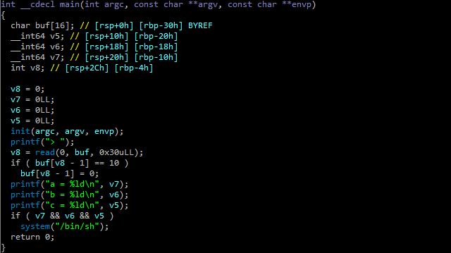
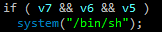
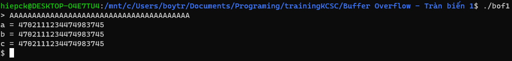

# Dùng ida để xem mã giả của file

- lỗi buffer overflow xảy ra tại mảng char buff khi nó được khởi tạo 16byte, nhưng hàm read() lại đọc vào nó 48byte.
- đọc tiếp cho đến khi thấy đoạn này

  

- shell được lấy khi v7=v6=v5
- vì vậy chỉ cần nhập buff sao cho tràn giá trị xuống tới v7
- mảng buff 16byte và 3 biến v5,,v6,v7 mỗi biến 8byte nên tổng số byte khi tràn xuống v7 là 40 byte
- vì thế chỉ cần nhập đầu của buff >= 40 là được

  

- thế là xong
