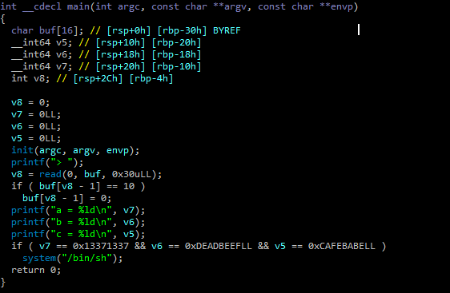
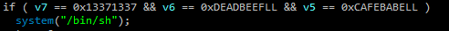
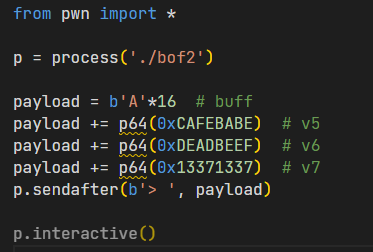
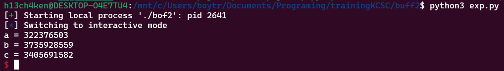

# Dùng ida để xem mã giả của file bof2

- Ở đây ta thấy tiếp tục xảy ra lỗi overflow tại mảng char buff[16] nhưng khi read() vào là 48 byte

- Ok, đọc tiếp cho tới cuối

- shell lấy được khi v7, v6, v5 bằng các giá trị tương ứng

- dùng python để viết script

- ban đầu buff là 16bit nên lúc đầu payload được tạo 16 kí tự

- và v5,v6,v7 được khởi tạo 64bit nên dùng p64

- run
  
