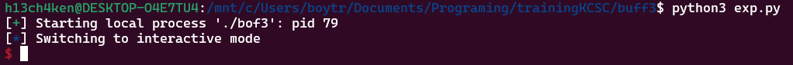

# dùng ida để xem mã giả c

- nhìn qua thì cũng biết chương trình bị overflow tại biến buff, nhưng không có gì đặc biệt khi không thấy "/bin/sh" để khai thác

-  ta hàm win() có chứa shell

- như vậy ta phải overwrite hàm win(), vì ở hàm main() nó không được gọi

# GDB

- sau khi chạy hết thì thấy địa chỉ hàm win()

# payload

- chưa hiểu đoạn địa chỉ % 16 nên em làm theo video (payload += p64(0x401249 + 5))

